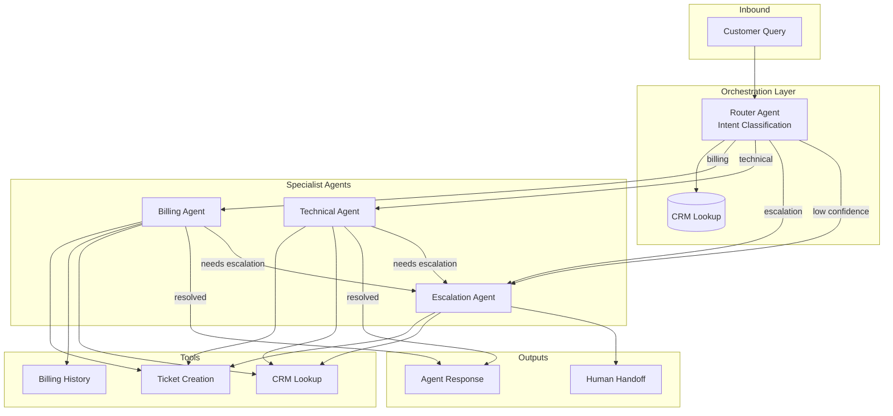

# Multi-Agent Orchestrator

Enterprise customer service system implemented with three agentic AI frameworks -- **Strands Agents**, **LangGraph**, and **CrewAI** -- to demonstrate architectural trade-offs in multi-agent orchestration.

## Architecture



## Key Patterns Demonstrated

| Pattern | Description |
|---------|-------------|
| Intent-based routing | Router agent classifies then delegates to specialists |
| Agent handoff with context | Full conversation history passed between agents |
| Human-in-the-loop escalation | Trigger conditions that pause for human review |
| Shared memory/state | Conversation memory persists across interactions |
| Tool reuse | CRM and ticketing tools shared across all agents |

## Framework Comparison

| Criteria | Strands Agents | LangGraph | CrewAI |
|----------|---------------|-----------|--------|
| **Architecture** | Autonomous agents with tool calling | Explicit state graph with conditional edges | Role-based agents with hierarchical delegation |
| **Control Flow** | Agent decides (LLM-driven) | Developer defines (graph-driven) | Manager delegates (hybrid) |
| **State Management** | External (you manage it) | Built-in TypedDict state | Internal crew memory |
| **Checkpointing** | Manual | Built-in MemorySaver | Not native |
| **Human-in-the-loop** | Custom implementation | Native graph interrupts | Callback-based |
| **Observability** | Tool call traces | Full state at every node | Verbose agent logs |
| **Best For** | AWS-native, minimal boilerplate, agent autonomy | Auditable workflows, regulated environments, replay | Collaborative reasoning, complex delegation chains |
| **Trade-off** | Less deterministic routing | More boilerplate code | Less predictable execution paths |

## When to Pick Each

**Strands Agents** -- when you want lightweight orchestration on AWS with Bedrock, agents that decide their own tool usage, and minimal framework overhead. The `@tool` decorator and `Agent()` constructor get you running in minutes.

**LangGraph** -- when you need deterministic flow control, audit trails of every state transition, and built-in checkpointing for pause/resume workflows. Required for regulated industries (insurance, healthcare) where you must prove what happened at each step.

**CrewAI** -- when your problem benefits from agents reasoning about their roles and collaborating naturally. The hierarchical process lets a manager review specialist work before finalizing. Best for complex multi-step workflows where agent judgment matters.

## Project Structure

```
multi-agent-orchestrator/
├── src/
│   ├── common/
│   │   ├── models.py          # Shared Pydantic models
│   │   └── config.py          # Shared configuration
│   ├── strands_impl/
│   │   ├── orchestrator.py    # Main entry point
│   │   ├── agents/
│   │   │   ├── router.py      # Intent classification
│   │   │   ├── billing.py     # Billing specialist
│   │   │   ├── technical.py   # Technical specialist
│   │   │   └── escalation.py  # Escalation handler
│   │   └── tools/
│   │       ├── crm_lookup.py  # CRM integration
│   │       └── ticket_create.py # Ticketing integration
│   ├── langgraph_impl/
│   │   ├── graph.py           # StateGraph definition
│   │   ├── nodes.py           # Node functions
│   │   └── state.py           # TypedDict state
│   └── crewai_impl/
│       ├── crew.py            # Crew assembly
│       ├── agents.py          # Agent definitions
│       └── tasks.py           # Task definitions
├── benchmarks/
│   └── compare.py            # Cross-framework comparison
├── tests/
│   └── test_routing.py       # Routing logic tests
├── pyproject.toml
├── requirements.txt
└── README.md
```

## Setup

### Prerequisites

- Python 3.11+
- AWS credentials configured with Bedrock access (`aws configure --profile bedrock`)
- Region: `us-west-2` (default for Bedrock models)

### Installation

```bash
# Clone and enter project
cd multi-agent-orchestrator

# Create virtual environment
python -m venv .venv
source .venv/bin/activate

# Install with all dependencies
pip install -e ".[dev,bench]"
```

### Environment Variables (optional overrides)

```bash
export AWS_REGION=us-west-2
export ROUTER_MODEL_ID=us.anthropic.claude-sonnet-4-20250514
export SPECIALIST_MODEL_ID=us.anthropic.claude-sonnet-4-20250514
export CONFIDENCE_THRESHOLD=0.7
export ESCALATION_THRESHOLD=0.3
export ENABLE_HITL=true
```

## Usage

### Run Strands Implementation

```bash
python -m src.strands_impl.orchestrator
```

### Run LangGraph Implementation

```bash
python -m src.langgraph_impl.graph
```

### Run CrewAI Implementation

```bash
python -m src.crewai_impl.crew
```

### Run Benchmark Comparison

```bash
# All frameworks
python -m benchmarks.compare

# Single framework
python -m benchmarks.compare --framework strands

# Custom query
python -m benchmarks.compare --query "My API is returning 500 errors" --customer-id CUST-002

# Save results
python -m benchmarks.compare --output benchmarks/results.json
```

### Run Tests

```bash
pytest tests/ -v
```

## Design Decisions

1. **Shared models layer** -- All frameworks use the same Pydantic models (`CustomerQuery`, `AgentResponse`, `EscalationRequest`) so the benchmark comparison is apples-to-apples.

2. **Tool reuse** -- CRM and ticketing tools are defined once (in `strands_impl/tools/`) and imported by all implementations. This reflects real-world where tools are organizational assets.

3. **Escalation as first-class flow** -- Not bolted on as error handling. Every implementation has explicit escalation paths with priority assessment and team routing.

4. **Confidence-gated routing** -- Below the threshold, queries go to escalation regardless of classified intent. Prevents low-confidence misrouting.

5. **Conversation memory** -- State preserved across interactions per customer, enabling multi-turn resolution without repeating context.

## License

MIT
